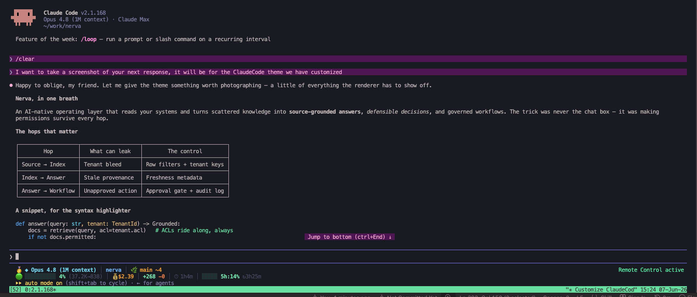
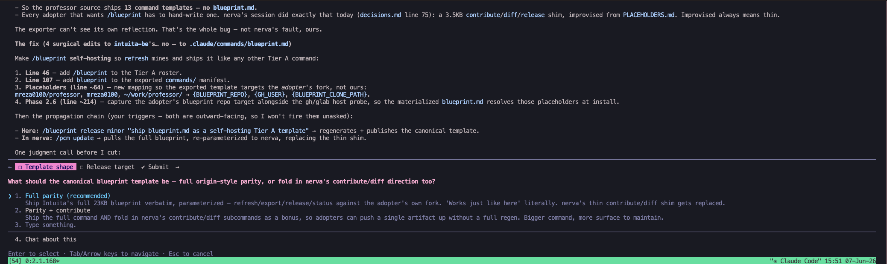

# Tokyo Night — a Claude Code theme

A loud, high-saturation custom theme for [Claude Code](https://code.claude.com), the CLI coding agent. Electric purple accents, neon-mint success, hot-pink text, laser-cyan plan mode — tuned to stay readable on a dark `#1a1b26` canvas.





> Requires **Claude Code v2.1.118 or later** (custom theme support).

## Palette

| Role                | Color     | Hex       |
| ------------------- | --------- | --------- |
| Brand accent / spinner (`claude`) | 🟣 electric purple | `#c95cff` |
| Default text (`text`) | 🩷 hot pink | `#ff9ed6` |
| Success (`success`) | 🟢 neon mint | `#00ffa3` |
| Error (`error`)     | 🔴 hot red-pink | `#ff3d6e` |
| Warning (`warning`) | 🟡 punchy yellow | `#ffd23f` |
| Plan mode (`planMode`) | 🩵 laser cyan | `#22e1ff` |
| Prompt border (`promptBorder`) | 🟦 electric indigo | `#7c4dff` |
| Bash border (`bashBorder`) | 🟠 vivid orange | `#ff8c42` |

The full token map (diffs, fullscreen backgrounds, subagent colors, usage meter, speaker labels, shimmer variants) lives in [`tokyo-night.json`](./tokyo-night.json).

## Install

Custom themes are JSON files in `~/.claude/themes/`. Claude Code watches that folder and **hot-reloads** — no restart needed.

### One-liner

```bash
mkdir -p ~/.claude/themes && \
  curl -fsSL https://raw.githubusercontent.com/rezzminator/claude-code-tokyo-night/main/tokyo-night.json \
  -o ~/.claude/themes/tokyo-night.json
```

### Manual

1. Download [`tokyo-night.json`](./tokyo-night.json).
2. Drop it into `~/.claude/themes/` (create the folder if it doesn't exist).

### Activate

Run `/theme` inside Claude Code, pick **Tokyo Night**, done. Your choice is saved to `~/.claude/settings.json` as `"theme": "custom:tokyo-night"`.

## Match your terminal background (optional)

The theme styles Claude Code's own elements, but the terminal's base background belongs to your terminal app. To paint the same `#1a1b26` canvas:

- **VS Code integrated terminal** — add to `settings.json`:
  ```jsonc
  "workbench.colorCustomizations": {
    "terminal.background": "#1a1b26"
  }
  ```
- **iTerm2 / Apple Terminal / Ghostty / Kitty / WezTerm** — set the profile/background color to `#1a1b26` in the app's settings.
- Or use Claude Code's `dark-ansi` base instead, which defers all colors to your terminal's palette.

## Customize

Tweak any token live: run `/theme`, highlight **Tokyo Night**, press `Ctrl+E` for an interactive editor with a live preview. Or edit `~/.claude/themes/tokyo-night.json` directly — it reloads on save.

Color values accept `#rrggbb`, `#rgb`, `rgb(r,g,b)`, `ansi256(n)`, or `ansi:<name>`. Unknown tokens and invalid values are ignored, so a typo can't break rendering. Full token reference: [Claude Code terminal config docs](https://code.claude.com/docs/en/terminal-config#create-a-custom-theme).

## Part of Professor

This theme ships as a personalization asset of **[Professor](https://github.com/rezzminator/professor)** — a transplantable Claude Code operating layer (multi-PhD persona, command pipeline, agents, and skills). Installs to `~/.claude/themes/` and applies the same way standalone or as part of a Professor install.

## License

MIT — do whatever you like.
